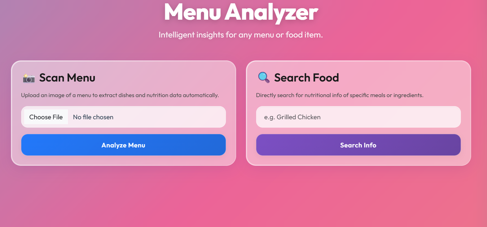
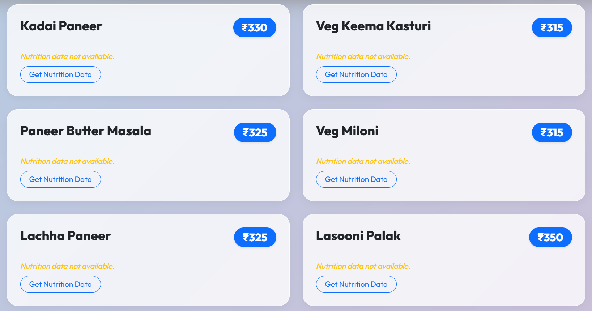
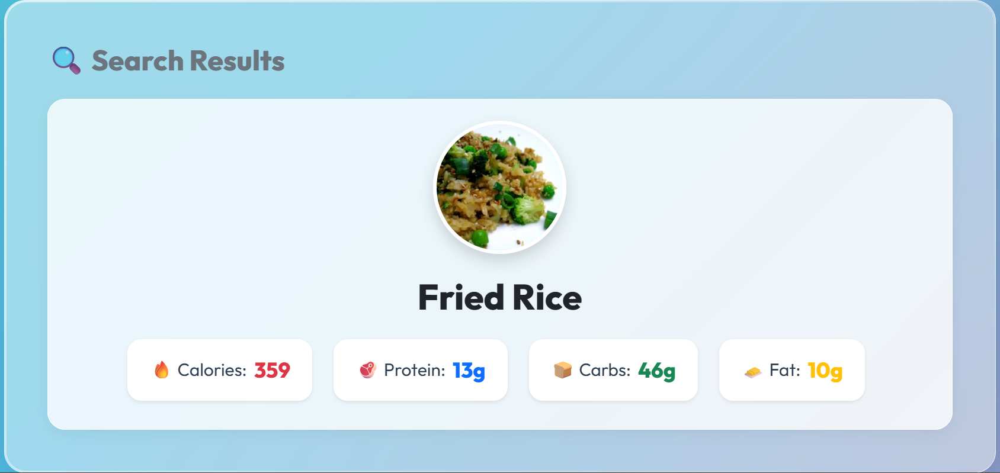

# 🍽️ Menu Analyzer (Intelligent OCR & Nutrition Insights)

[](https://menu-analyzer.loveesh.me)
[](https://www.oracle.com/java/)
[](https://spring.io/projects/spring-boot)
[](https://supabase.com/)
[](https://vercel.com/)
[](https://render.com/)

**Menu Analyzer** is a completely decoupled, cloud-deployed full-stack web application that allows users to upload images of restaurant menus, extract the dish names using Optical Character Recognition (OCR), and enrich each dish with detailed nutritional information, dietary classifications, and recipes via the Spoonacular Food API.

## 🔗 Live Application
**Try it out here:** [https://menu-analyzer.loveesh.me](https://menu-analyzer.loveesh.me)

---

## 📸 Application Screenshots

<div align="center">
  
  
</div>
<br>
<div align="center">
  
</div>

---

## ✨ Key Features

- **Decoupled Architecture:** Clean separation of concerns between a lightweight vanilla frontend and a heavy Java Spring Boot processing engine.
- **Document Processing**: Upload images of restaurant menus (`multipart/form-data`) and extract food items automatically using OCR space technology.
- **Data Enrichment**: Integrates with the Spoonacular Food Nutrition API to map simple string names to complex nutritional data objects (Calories, Protein, Fat, Carbs).
- **Persistent Cloud Database**: Uses Supabase (PostgreSQL) for robust, persistent storage of Menus and their associated Dishes via Spring Data JPA.
- **Direct Search**: Includes standalone endpoints to directly search the Spoonacular API for ad-hoc nutritional queries without uploading a menu.
- **CI/CD Automation**: Fully automated Github-hooked deployments via Vercel (Frontend) and Render Native Docker containers (Backend).

---

## 🏗️ Architecture & Tech Stack

This project is deployed using a modern, split-stack cloud configuration:

### Frontend
- **Tech:** HTML5, Vanilla JavaScript, Custom CSS (Glassmorphism design)
- **Deployment:** Vercel Global Edge Network
- **Domain:** `menu-analyzer.loveesh.me`

### Backend
- **Framework:** Spring Boot 3.x, Spring Web, Spring Data JPA
- **Language:** Java 17
- **Deployment:** Render (Dockerized Java Environment)
- **Domain:** `api.menu-analyzer.loveesh.me`

### Database
- **Provider:** Supabase
- **Engine:** PostgreSQL 15+ (Using IPv4 Session Pooler)
- **ORM:** Hibernate

---

## 🚀 Local Development Setup

### Prerequisites
- JDK 17
- Maven
- A free Spoonacular API Key

### 1. Configure Backend Environment Variables
Navigate to the `backend/` directory. You will need to provide the following variables via your IDE or terminal environment:
```env
DB_URL=jdbc:postgresql://localhost:5432/menu_analyzer
DB_USERNAME=postgres
DB_PASSWORD=yourpassword
OCR_API_KEY=your_ocr_key
SPOONACULAR_API_KEY=your_spoonacular_key
```

### 2. Run the Spring Boot Server
You can run the application directly using the Maven Wrapper from your terminal:
```bash
./mvnw clean package
java -jar target/Menu-Analyzer-0.0.1-SNAPSHOT.jar
```
*The backend API will start on `http://localhost:8080/api/v1`*

### 3. Run the Frontend
Simply open `/frontend/index.html` in your browser, or use a tool like Live Server. Ensure the `app.js` file is pointing its `API_BASE_URL` to your localhost port.

---

## 📖 API Endpoint Reference

All endpoints are prefixed with `/api/v1`.

### Menu Processing Flow
| Method | Endpoint | Description |
| :--- | :--- | :--- |
| `POST` | `/menus/scan` | Uploads a menu image (`file`) and returns parsed dishes. |
| `GET` | `/menus/{menuId}` | Retrieves a previously scanned menu and its dishes. |
| `GET` | `/menus/{menuId}/dishes` | Retrieves all standard dishes parsed for a single menu. |
| `POST`| `/menus/{menuId}/dishes/{dishId}/enrich`| Forces Spoonacular to pull real nutrition data for the dish and saves it to the DB. |

### Direct Search Flow
| Method | Endpoint | Description |
| :--- | :--- | :--- |
| `GET` | `/foods/search?query={food_name}` | Direct lookup to Spoonacular for comprehensive nutritional data about a food item. |

---
*Developed by [Loveesh Singh]*
